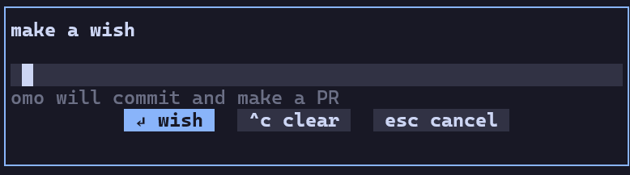
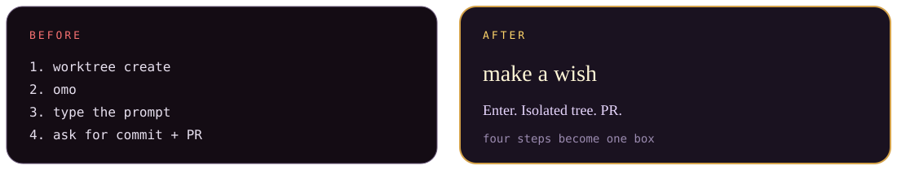
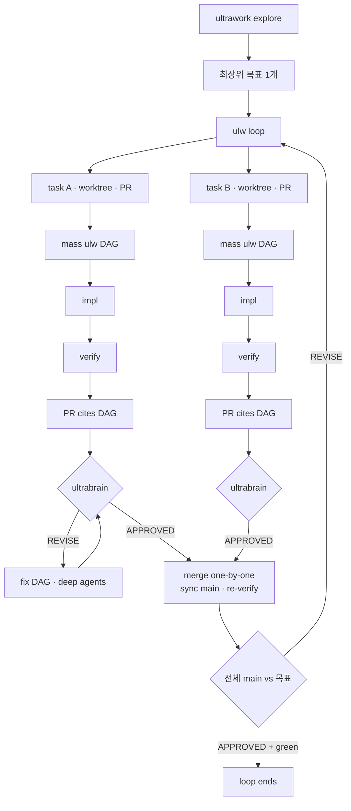
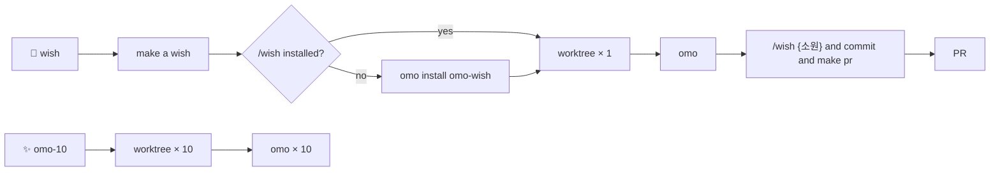

<p align="center">
  
</p>

<p align="center">
  
</p>

<h1 align="center">🧞 herdr-wish</h1>

<p align="center">
  <b>소원 한 줄이면, 새 워크트리에서 omo에 <code>/wish</code> 를 강제로 넣는다.</b>
</p>

<p align="center">
  <i>한 문장. 한 칸. <code>/wish</code>. mass ulw DAG. APPROVED 가 나올 때까지.</i>
</p>

<p align="center">
  <a href="https://herdr.dev"></a>
  <a href="https://nodejs.org"></a>
  <a href="https://github.com/MovieHolic-Plex/herdr-wish/actions/workflows/test.yml"></a>
  <a href="LICENSE"></a>
</p>

<p align="center">
  <a href="https://github.com/MovieHolic-Plex/herdr-wish/stargazers"></a>
  <a href="https://github.com/MovieHolic-Plex/herdr-wish/commits/main"></a>
  
</p>

<p align="center">
  <a href="#-램프를-켜는-법">설치</a> ·
  <a href="#핵심-wish">/wish</a> ·
  <a href="#기법-mass-ulw-dag">기법</a> ·
  <a href="#-두-가지-주문">주문</a> ·
  <a href="#-쓰기">쓰기</a> ·
  <a href="#-설정">설정</a> ·
  <a href="#-램프-안에서">구조</a>
</p>

```
                    .
                   / \
                  / ✦ \
                 |  ~  |
                  \   /
                ___\_/___
               /  * * *  \
              |  W I S H  |
               \_________/
                  |   |
         right-click · type · enter
```

<p align="center">
  
</p>

<p align="center">
  <code>make a wish</code> &nbsp;→&nbsp; 새 워크트리 &nbsp;→&nbsp; omo &nbsp;→&nbsp; <code>/wish {소원} and commit and make pr</code>
</p>

<p align="center">
  
</p>

## 네 줄이 한 숨이 된다

에이전트에게 일을 맡기는 절차는 매번 같다. 워크트리를 만들고, `omo` 를 켜고, 프롬프트를 치고, 커밋과 PR을 다시 부탁한다.

그 네 줄을 램프 한 칸에 접었다.

<p align="center">
  
</p>

램프는 마법이 아니다. [Herdr](https://herdr.dev) 가 칸을 열고, [omo `/wish`](https://github.com/DevNewbie1826/omo-wish) 가 일을 한다.  
우클릭 한 번으로 **지금 보고 있는 칸을 더럽히지 않고**, omo 입력창에 `/wish` 를 직접 치지 않아도 된다.

<p align="center">
  
</p>

## 핵심: /wish

이게 이 플러그인의 전부다. 모달에 적은 문장은 평범한 채팅으로 가지 않는다. omo 슬래시 스킬 **`/wish`** 로 들어간다.

```
/wish fix the login bug and commit and make pr
```

이미 `/wish` 로 시작해도 한 번만 붙는다. 끝에 `and commit and make pr` 이 있으면 한 번 더 붙이지 않는다.

[`DevNewbie1826/omo-wish`](https://github.com/DevNewbie1826/omo-wish) 가 그 스킬이다. ultrawork explore, 태스크 묶기, 워크트리·PR, ulw loop. 이 플러그인은 그 주문을 **빠뜨리지 못하게** 앞에 고정한다.

소원을 빌기 **전에** `omo list` / `~/.omo/agent/settings.json` 과 체크아웃을 본다. `/wish` 가 없으면 유저 스코프에 설치한다.

```sh
omo install https://github.com/DevNewbie1826/omo-wish --no-approve
```

이미 있으면 그대로 두고, 없을 때만 이 명령을 대신 친다. 그 다음 새 워크트리에서 omo를 켜므로 방금 깐 스킬이 세션에 들어간다.

<p align="center">
  
</p>

## 기법: mass ulw DAG

램프가 넣는 한 줄은 채팅이 아니다. [omo-wish](https://github.com/DevNewbie1826/omo-wish) 가 **ultrawork + ulw loop + mass ulw** 오케스트레이션을 켠다. 소원은 목표가 되고, 목표는 DAG 가 되고, DAG 는 PR 이 된다.

<p align="center">
  
</p>

### 1. ultrawork explore — 목표는 하나

맥락과 히스토리를 읽고, 증거로 문제를 가른 다음 **이상적인 상태를 최상위 목표 하나**로 고정한다.  
그 다음부터 태스크·리뷰·머지는 전부 이 목표의 하인이다. 태스크는 별도 목표가 아니다.

### 2. 관련되면 한 태스크, 아니면 DAG

서로 정합성을 해칠 수 있으면 한 태스크에 묶는다. 의심스러우면 붙이거나 의존으로 둔다.  
독립일 때만 갈라서 **동시에** 돌린다. 의존하는 태스크는 앞 태스크가 merge 된 뒤에야 시작한다.

### 3. 태스크마다 mass ulw DAG

태스크 하나 = 전용 git worktree + 전용 PR + 전용 리뷰 루프 + 전용 merge.

체인 모양은 항상 같다. 작은 수정도 예외가 없다.

```
impl ──► verify ──► PR ──► ultrabrain
  │
  └─ 독립이면 구현 노드끼리 병렬
```

| 노드 | 하는 일 |
| --- | --- |
| **impl** | 실제 코드. 서로 정확성을 안 해칠 때만 병렬, 아니면 의존 순서 |
| **verify** | 그 DAG 가 맞는지 검증 |
| **PR** | PR 본문에 **이 DAG run 을 인용** |
| **ultrabrain** | 마지막 노드. 판결은 `APPROVED` 아니면 `REVISE` 뿐 |

오케스트레이션 세션은 저장소 파일을 **절대 직접 고치지 않는다.** 충돌 해소까지 포함해, 모든 변경은 DAG 노드가 한다.

### 4. REVISE 면 fix DAG

`REVISE` 가 나오면 번호 매긴 요구 사항이 나온다.  
같은 워크트리에서 다음 DAG 를 깐다. 요구 사항마다 deep agent 를 붙이고, 독립이면 병렬, 그다음 verify → ultrabrain 재검토. `APPROVED` 가 나올 때까지 반복한다.

`APPROVED` 없이 main 에 올리는 일은 없다.

### 5. merge 는 한 줄씩, 마지막에 전체를 본다

- merge 는 **한 번에 하나씩**
- 직전: 최신 main 과 동기화하고 검증을 다시 돌린다
- 충돌, 리뷰한 diff 가 바뀜, 재검증 실패 → 그 태스크를 **fix DAG** 로 되돌린다. ultrabrain 이 다시 `APPROVED` 를 준 뒤에만 merge
- 나중에 발견한 일은 같은 관련성 규칙으로 기존 태스크에 합치거나 새 태스크로 묶는다
- 모든 태스크가 merge 되고 main 이 초록이면, ultrabrain 이 **전체 main 을 처음 그 최상위 목표**로 다시 본다
- 여기서 `REVISE` 면 그 지적을 같은 루프의 새 태스크로 넣는다

ulw loop 가 끝나는 조건은 세 가지가 **동시에** 참일 때뿐이다.

1. 모든 태스크가 `APPROVED` 로 merge 됨  
2. main 이 초록  
3. 최종 전체 검토가 `APPROVED`



이 기계의 본문은 [`prompts/wish.md`](https://github.com/DevNewbie1826/omo-wish/blob/main/prompts/wish.md) 다.  
`wish-ultrawork-arm.js` 가 슬래시 확장 **이후** 텍스트에서 `ultrawork` / `ulw` 를 보고 세션을 arm 한다. 그래서 이 플러그인이 `/wish` 를 **강제로** 앞에 붙이는 것이다. 빼면 램프가 아니라 그냥 문장이다.

<p align="center">
  
</p>

## 두 가지 주문

<p align="center">
  
</p>

| | **wish** | **omo-10** |
| :---: | --- | --- |
| 소환 | git 스페이스 우클릭 | git 스페이스 우클릭 / `prefix+shift+w` |
| 워크트리 | **하나.** 영어면 `wish-fix-the-login-bug`, 한글만 있으면 `wish-1` | `omo-1` … `omo-10`. 이미 있으면 이어서 |
| 에이전트 | 그 칸에서 `omo` | 칸마다 `omo` |
| 프롬프트 | **강제** <code>/wish {소원} and commit and make pr</code> | 없음. 열 개만 깐다 |
| 빈 입력 | 보내지 않음 | — |

우클릭 **wish** 는 Rename 과 같은 입력 창이다.  
제목 `make a wish`. 힌트 `omo /wish — commit and make a PR`. 버튼 `↵ wish`.

`prefix+shift+w` 는 **omo-10** 이다. 소원을 비는 키가 아니다.

> 열 개를 진짜로 깐다. 실험은 버려도 되는 저장소에서 하라.

<p align="center">
  
</p>

## 램프를 켜는 법

준비물: [Herdr](https://herdr.dev) `0.8+` · [Node.js](https://nodejs.org) `18+` · PATH 위의 `omo`

`/wish` 스킬([omo-wish](https://github.com/DevNewbie1826/omo-wish))은 없어도 된다. 첫 소원에서 없으면 설치한다.

```bash
herdr plugin install MovieHolic-Plex/herdr-wish --yes
```

이미 `local.wish` 를 로컬로 링크해 두었다면, 설치 전에 먼저 푼다.

```bash
herdr plugin unlink local.wish
herdr plugin install MovieHolic-Plex/herdr-wish --yes
```

개발 중이면 이 폴더를 직접 링크한다.

```bash
herdr plugin link .
```

키는 `~/.config/herdr/config.toml` 또는 Windows `%APPDATA%\herdr\config.toml`.

```toml
[[keys.command]]
key = "prefix+shift+w"
type = "plugin_action"
command = "local.wish.spawn"
description = "omo-10: 10 worktrees + omo"

[[keys.command]]
key = "prefix+shift+e"
type = "plugin_action"
command = "local.wish.cast"
description = "wish: selected text to a new worktree"
```

`local.wish.cast` 는 터미널에서 **선택한 글** 을 소원으로 쓴다.  
모달 입력창은 커스텀 Herdr 클라이언트에 들어 있다. 스톡 Herdr 에서는 선택 영역 + `cast`, 또는:

```bash
set WISH_TEXT=fix the login bug
herdr plugin action invoke cast --plugin local.wish
```

플러그인 id 는 `local.wish`. 액션은 `cast` (wish) · `spawn` (omo-10).

<p align="center">
  
</p>

## 쓰기

### wish — 소원 하나, 칸 하나

1. git 스페이스를 우클릭하고 **wish**
2. `make a wish` 에 영어든 한국어든 적는다
3. Enter

부모 저장소에 워크트리를 **새로** 만든다.  
영어 소원은 `wish-fix-the-login-bug`. 한글만 있으면 `wish-1`부터. 이미 있는 이름은 `-2`로 민다.  
새 칸에서 `omo`를 켠 다음, 아래를 **그대로** 넣는다.

```
/wish fix the login bug and commit and make pr
```

### omo-10 — 한 번에 열 칸

git 스페이스, 또는 워크트리 그룹에서 **omo-10**.  
링크된 워크트리 위에서 눌러도 부모 저장소에 만든다.

<p align="center">
  
</p>

## 설정

`herdr plugin config-dir local.wish` 폴더의 `config.json`.  
예시는 [`config.example.json`](config.example.json).

```json
{
  "count": 10,
  "command": "omo",
  "branchPrefix": "omo"
}
```

<table>
  <tr>
    <th>키</th>
    <th>기본</th>
    <th>의미</th>
  </tr>
  <tr>
    <td><code>count</code></td>
    <td align="center"><code>10</code></td>
    <td>omo-10 이 만들 워크트리 수</td>
  </tr>
  <tr>
    <td><code>command</code></td>
    <td align="center"><code>omo</code></td>
    <td>각 칸에서 실행할 에이전트</td>
  </tr>
  <tr>
    <td><code>branchPrefix</code></td>
    <td align="center"><code>omo</code></td>
    <td>omo-10 브랜치/라벨. <code>omo-1</code>, <code>omo-2</code>, …</td>
  </tr>
</table>

환경 변수가 파일을 덮는다.

| 변수 | 역할 |
| --- | --- |
| `WISH_TEXT` | 모달 / `selected_text` 대신 쓸 소원 |
| `WISH_COUNT` | 워크트리 개수 |
| `WISH_COMMAND` | 에이전트 명령 |
| `WISH_PREFIX` | omo-10 브랜치 접두사 |

이 저장소에는 키도, 토큰도, 실제 `config.json` 도 **없다.**

<p align="center">
  
</p>

## 램프 안에서



| 파일 | 역할 |
| --- | --- |
| `herdr-plugin.toml` | id `local.wish` · `cast` / `spawn` |
| `wish.js` | Herdr CLI로 워크트리 · pane · prompt |
| `wish.test.js` | 이름 고르기와 프롬프트 접미사 |

별도 SDK는 없다. `HERDR_BIN_PATH` 가 그 세션의 `herdr` 이다.

```bash
node --test wish.test.js
```

<p align="center">
  
</p>

<p align="center">
  <b><a href="LICENSE">MIT</a></b><br>
  소원을 포크해도, 램프를 다른 에이전트에 꽂아도 된다.
</p>
