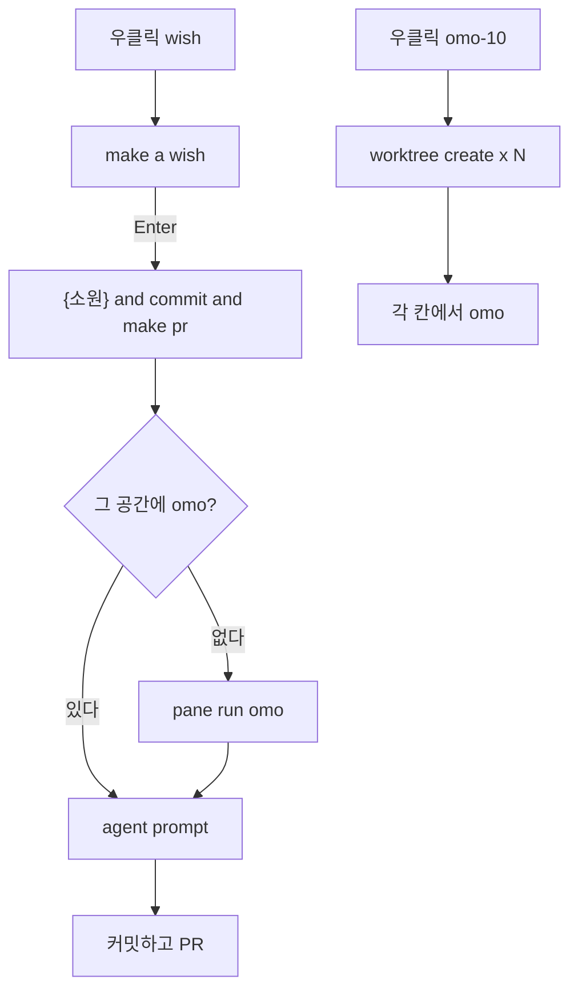

<p align="center">
  
</p>

```
              .
             / \
            / ✦ \
           |     |
            \   /
          ___\_/___
         /  * * *  \
        |  W I S H  |
         \_________/
            |   |
```

# 🧞 herdr-wish

**소원을 적으면, omo가 커밋하고 PR까지 만든다.**

[Herdr](https://herdr.dev) 스페이스에서 우클릭 한 번.  
램프는 문장을 받고, 에이전트는 브랜치를 밀어 올린다.  
워크트리 10개가 필요하면 주문을 바꿀 필요 없다. **omo-10**.

[](https://herdr.dev)
[](https://nodejs.org)
[](https://github.com/MovieHolic-Plex/herdr-wish)
[](LICENSE)

[왜](#-왜-램프가-필요한가) · [두 주문](#-두-가지-주문) · [설치](#-설치) · [쓰기](#-쓰기) · [설정](#-설정) · [흐름](#-램프-안에서)

<p align="center">
  
</p>

---

## 왜 램프가 필요한가

에이전트에게 일을 맡기는 절차는 매번 같다.

1. 워크트리를 만들고
2. `omo` 를 켜고
3. 프롬프트를 치고
4. 커밋과 PR을 다시 부탁한다

그 네 줄을 한 칸에 접었다.  
**wish** 는 문장을 받는다. 뒤에 `and commit and make pr` 을 붙인다. omo가 꺼져 있으면 먼저 깨운다.  
**omo-10** 은 git 공간에서 워크트리 10개를 깔고, 칸마다 omo를 켠다.

램프는 마법이 아니다. Herdr CLI를 순서대로 두드리는 플러그인이다.

---

## 두 가지 주문

| 주문 | 어디서 | 하는 일 |
| :---: | --- | --- |
| **wish** | 모든 스페이스 우클릭 | `make a wish` 모달. 입력한 문장 + `and commit and make pr` 을 그 공간의 omo에 넣는다 |
| **omo-10** | git 스페이스 우클릭 | `omo-1` … `omo-10` 워크트리를 만들고 각 루트 칸에서 `omo` 를 실행한다 |

우클릭 메뉴의 **wish** 모달은 Rename 과 같은 입력 창이다. 제목은 영어 `make a wish`. 힌트는 `omo will commit and make a PR`. 버튼은 `↵ wish`.

비어 있는 소원은 보내지 않는다. 이미 문장 끝에 `and commit and make pr` 이 있으면 한 번 더 붙이지 않는다.

`prefix+shift+w` 는 **omo-10** 이다. 소원을 비는 키가 아니다.

---

## 설치

준비물: [Herdr](https://herdr.dev) 0.8+, [Node.js](https://nodejs.org) 18+, PATH 위의 `omo`.

```bash
herdr plugin install MovieHolic-Plex/herdr-wish --yes
```

이미 `local.wish` 를 로컬로 링크해 두었다면, 설치 전에 먼저 푼다.

```bash
herdr plugin unlink local.wish
herdr plugin install MovieHolic-Plex/herdr-wish --yes
```

개발 중이면 이 폴더를 직접 링크한다.

```bash
herdr plugin link .
```

키바인딩은 `~/.config/herdr/config.toml` 또는 Windows의 `%APPDATA%\herdr\config.toml`:

```toml
[[keys.command]]
key = "prefix+shift+w"
type = "plugin_action"
command = "local.wish.spawn"
description = "omo-10: 10 worktrees + omo"

[[keys.command]]
key = "prefix+shift+e"
type = "plugin_action"
command = "local.wish.cast"
description = "wish: send selected text to omo"
```

`local.wish.cast` 는 터미널에서 **선택한 글** 을 소원으로 쓴다.  
모달 입력창은 커스텀 Herdr 클라이언트에 들어 있다. 스톡 Herdr 에서는 선택 영역 + `cast` 키, 또는 아래 환경 변수로 같은 일을 한다.

```bash
# 포커스된 git 공간에 소원을 직접 던질 때
set WISH_TEXT=fix the login bug
herdr plugin action invoke cast --plugin local.wish
```

플러그인 id 는 `local.wish` 다. 액션은 `cast` (wish) 와 `spawn` (omo-10).

---

## 쓰기

### wish

1. 스페이스를 우클릭하고 **wish** 를 고른다
2. `make a wish` 에 영어든 한국어든 소원을 적는다
3. Enter

omo가 이미 그 공간에 있으면 그 칸으로 간다. 없으면 포커스된 칸(없으면 첫 칸)에서 `omo` 를 켜고, 준비가 되면 프롬프트를 넣는다.

보내는 문장은 항상 이런 모양이다.

```
fix the login bug and commit and make pr
```

### omo-10

git 스페이스, 또는 워크트리 그룹에서 **omo-10**.  
이미 `omo-1` 이 있으면 `omo-11` 부터 이어 간다. 링크된 워크트리 위에서 눌러도 부모 저장소에 만든다.

열 개를 진짜로 깐다. 실험은 버려도 되는 저장소에서 하라.

---

## 설정

`herdr plugin config-dir local.wish` 가 가리키는 폴더의 `config.json`.

예시는 [`config.example.json`](config.example.json).

```json
{
  "count": 10,
  "command": "omo",
  "branchPrefix": "omo"
}
```

| 키 | 기본 | 의미 |
| --- | :---: | --- |
| `count` | `10` | omo-10 이 만들 워크트리 수 |
| `command` | `omo` | 각 칸에서 실행할 에이전트 |
| `branchPrefix` | `omo` | 브랜치/라벨 접두사. `omo-1`, `omo-2`, … |

환경 변수가 파일을 덮는다.

| 변수 | 역할 |
| --- | --- |
| `WISH_TEXT` | 모달/`selected_text` 대신 쓸 소원 |
| `WISH_COUNT` | 워크트리 개수 |
| `WISH_COMMAND` | 에이전트 명령 |
| `WISH_PREFIX` | 브랜치 접두사 |

이 저장소에는 키도, 토큰도, 실제 `config.json` 도 없다.

---

## 램프 안에서



| 파일 | 역할 |
| --- | --- |
| `herdr-plugin.toml` | 플러그인 id `local.wish`, 액션 `cast` / `spawn` |
| `wish.js` | Herdr CLI로 워크트리·pane·prompt |
| `wish.test.js` | 이름 고르기와 프롬프트 접미사 |

Herdr 플러그인 v1 은 별도 SDK 가 없다. `HERDR_BIN_PATH` 로 그 세션의 `herdr` 을 부른다.

---

## 테스트

```bash
node --test wish.test.js
```

---

## 라이선스

[MIT](LICENSE) — 소원을 포크해도, 램프를 다른 에이전트에 꽂아도 된다.
